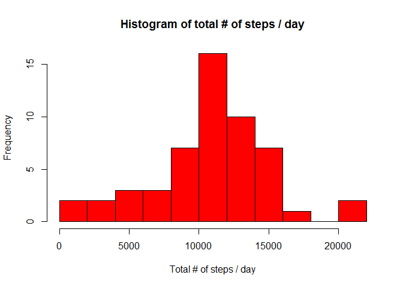

# Reproducible Research: Peer Assessment 1


## Loading and preprocessing the data

Unzipping the data


```r
library(lubridate)
library(ggplot2)
zipfile="activity.zip"  
unzip(zipfile)
rm(zipfile)
```

Loading the data into a data frame and processing the dates as POSIXct


```r
activity <- read.csv (file = "activity.csv")
activity$datetime <- as.POSIXct(strptime(paste(activity$date, 
                                               formatC(activity$interval, width=4, flag="0"), sep=" "),
                                               format = "%Y-%m-%d %H%M"))
activity$date <- as.POSIXct(strptime(activity$date, format = "%Y-%m-%d"))

#activity$timelapse<-hm(paste(substr(formatC(activity$interval, width=4, flag="0"),1,2),
#                                       " ",substr(formatC(activity$interval, width=4, flag="0"),3,4)))

#activity$dec_hour <- hour(activity$datetime) + minute(activity$datetime)/60
```


## What is mean total number of steps taken per day?

Calculate the total number of steps taken per day (ignoring NA's)


```r
total_steps_day <- aggregate(steps~date,activity,sum)
```

Make a histogram of the total number of steps taken each day  
We can see that the most frequent count is between 10-12k steps per day.   
From the 53 days with data, the person walked between 10-12k steps 16 days.
 

```r
hist(total_steps_day$steps,
     breaks = 10, col="red",
     main="Histogram of total # of steps / day", 
     xlab = "Total # of steps / day")
```

 

Calculate and report the mean and median of the total number of steps taken per day


```r
mean(total_steps_day$steps)
```

```
## [1] 10766.19
```

```r
median(total_steps_day$steps)
```

```
## [1] 10765
```

## What is the average daily activity pattern?


```r
avg_steps_time_slot <- aggregate(steps~interval,activity,mean)
avg_steps_time_slot$dec_hour<-as.numeric(substr(formatC(avg_steps_time_slot$interval, width=4, flag="0"),1,2))+
                              as.numeric(substr(formatC(avg_steps_time_slot$interval, width=4, flag="0"),3,4))/60


#avg_steps_time_slot$timelapse<-60*as.numeric(substr(formatC(avg_steps_time_slot$interval, width=4, flag="0"),1,2))+
#                                  as.numeric(substr(formatC(avg_steps_time_slot$interval, width=4, flag="0"),3,4))

#avg_steps_time_slot$hm<-hm(paste(substr(formatC(avg_steps_time_slot$interval, width=4, flag="0"),1,2),
#                                         " ",substr(formatC(avg_steps_time_slot$interval, width=4, flag="0"),3,4)))
```


Make a time series plot (i.e. type = "l") of the 5-minute interval (x-axis) and the average number of steps taken, averaged across all days (y-axis)


```r
plot(x = avg_steps_time_slot$dec_hour, 
     y = avg_steps_time_slot$steps,
     ylab = "avg steps taken" ,xlab="Decimal Hour",main="Average number of steps taken",
     pch=20, 
     type="l")

abline (v=avg_steps_time_slot[avg_steps_time_slot$steps== max(avg_steps_time_slot$steps),3],col="red")
```

 

Which 5-minute interval, on average across all the days in the dataset, contains the maximum number of steps?


```r
avg_steps_time_slot[avg_steps_time_slot$steps== max(avg_steps_time_slot$steps),]
```

```
##     interval    steps dec_hour
## 104      835 206.1698 8.583333
```

On average across all the days in the dataset the slot 835 which correspond with decimal hour 8.5833333 contains the maximum number of steps (206.1698113) 

## Imputing missing values

Calculate and report the total number of missing values in the dataset (i.e. the total number of rows with NAs)


```r
sum(is.na(activity$steps))
```

```
## [1] 2304
```

There are 2304 values missing which represent 13.11% of the total number of values. That is equivalent to 8.00 days without data.
   
   
All of the missing values in the dataset will be filled with the mean for that 5-minute interval and a new dataset that is equal to the original dataset but with the missing data filled in must be created


```r
activity_noNA<-activity
for (i in 1:nrow(activity)) {
        if (is.na(activity_noNA$steps[i])) 
                activity_noNA$steps[i] <- 
                avg_steps_time_slot[avg_steps_time_slot$interval == activity_noNA$interval[i],2]
        
}
```

Make a histogram of the total number of steps taken each day and Calculate and report the mean and median total number of steps taken per day. Do these values differ from the estimates from the first part of the assignment? What is the impact of imputing missing data on the estimates of the total daily number of steps?


```r
total_steps_day_noNA <- aggregate(steps~date,activity_noNA,sum)
mean(total_steps_day_noNA$steps)
```

```
## [1] 10766.19
```

```r
median(total_steps_day_noNA$steps)
```

```
## [1] 10766.19
```

```r
hist(total_steps_day_noNA$steps,
     breaks = 10, col="red",
     main="Histogram of total # of steps / day", 
     xlab = "Total # of steps / day")
```

 

The median and the average do not differ significantly with the ones calculated with the NA's present. This could be expected because we have completed the data set with mean values for the missing data. However the peak of the histogram is now increased by 8 days (the 8 missing days)


## Are there differences in activity patterns between weekdays and weekends?

Create a new factor variable in the dataset with two levels - "weekday" and "weekend" indicating whether a given date is a weekday or weekend day.


```r
activity_noNA$wday<-factor((wday(activity_noNA$date) %in% 2:6),
                           levels=c(FALSE,TRUE), labels=c("weekend","weekday"))
```

Make a panel plot containing a time series plot (i.e. type = "l") of the 5-minute interval (x-axis) and the average number of steps taken, averaged across all weekday days or weekend days (y-axis). 


```r
avg_steps_time_slot_noNA <- aggregate(steps~wday+interval,activity_noNA,mean)
avg_steps_time_slot_noNA$dec_hour <- 
        as.numeric(substr(formatC(avg_steps_time_slot_noNA$interval, width=4, flag="0"),1,2))+
        as.numeric(substr(formatC(avg_steps_time_slot_noNA$interval, width=4, flag="0"),3,4))/60

g<-ggplot(data = avg_steps_time_slot_noNA, aes(dec_hour,steps))
g +     facet_grid(wday~.)+
        geom_line(aes(color=wday))+
        labs(y="# of steps",x="decimal hour")
```

 

Comparing the two plots we can appreciate that activity begins earlier during the weekdays but after a peak in the morning then remains low. During the weekend the activity is more evenly distributed during the whole day.

